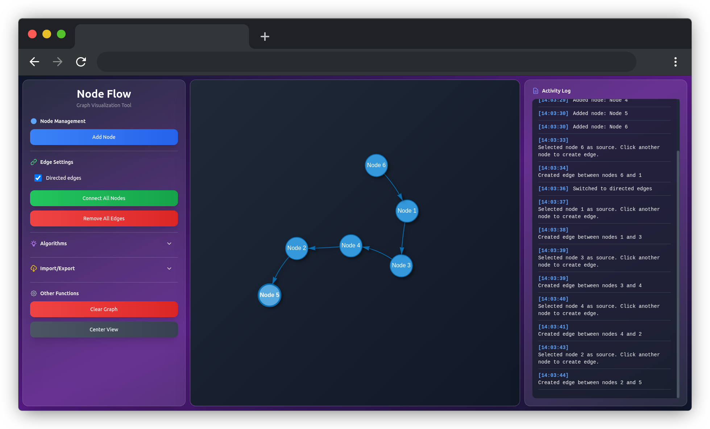

# Node Flow

A simple web application for graph visualization and algorithms written in HTML, CSS and JavaScript using the vis.js library.

## Features

### Node Management

- 🔵 **Adding nodes** - Click "Add Node" to create a new vertex
- ✏️ **Editing nodes** - Select a node and click "Edit Node" to change:
  - Node name
  - Node color
  - Node size (10-50px)
- 🗑️ **Deleting nodes** - Select a node and click "Delete Node"
- 🖱️ **Moving nodes** - Drag nodes with the mouse

### Edge Management

- 🔗 **Adding edges** - Click "Add Edge", then click two nodes
- ↔️ **Directed/undirected edges** - Check the "Directed edges" checkbox
- ✏️ **Editing edges** - Select an edge and click "Edit Edge" to change:
  - Edge weight
  - Edge label
  - Edge color
- 🗑️ **Deleting edges** - Select an edge and click "Delete Edge"

### Algorithms

- 🔍 **BFS (Breadth-First Search)** - Breadth-first search with visualization
- 🌳 **DFS (Depth-First Search)** - Depth-first search with visualization
- 🎯 **Start node selection** - Dropdown list with available nodes
- ⏹️ **Algorithm stopping** - "Stop" button interrupts execution

### Other Features

- 🧹 **Graph clearing** - Removes all nodes and edges
- 🎯 **Graph centering** - Fits view to all elements
- ℹ️ **Information panel** - Displays information about selected elements
- 📱 **Responsive design** - Adapts to different screen sizes

## Technologies

- **HTML5** - Application structure
- **CSS3** - Styling and responsive design
- **JavaScript (ES6+)** - Application logic and algorithms
- **vis.js** - Graph visualization library (loaded from CDN)
